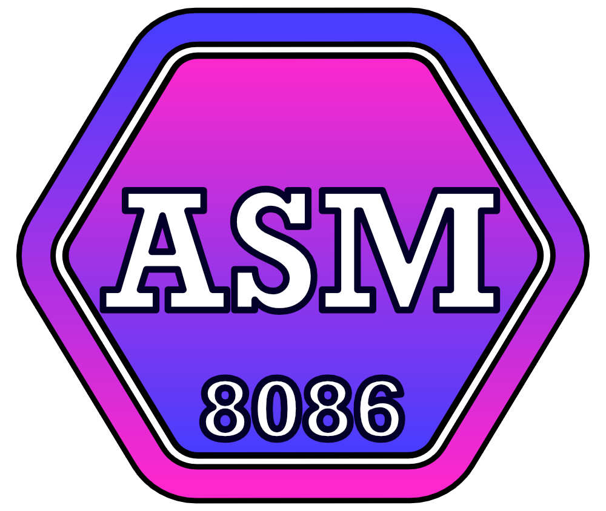

<p align="Center"></p>
<h3 align="Center">2Q2 - Développement Assembleur</h3>

# Exercices 03 - Pointeurs SI & DI, heure système.

#### 📝 Lien vers les [notes de cours](https://slides.com/hkoncept/2q2-03/fullscreen?token=sviAWFto) !

#### 📁 [Structures de projets & consignes à suivre](../includes/rules.md)

## 🙃 Question 01 - Le monde à l'envers 

Un petit lutin malin s'est amusé à tout transformer en phrase à l'envers, aider le vieux sage aux yeux fatigués à lire le message du bon côté. Il faudra que votre algorithme fonctionne pour plusieurs différents messages tous encodés de la même façon.

> ATTENTION: Il est inutile de compter le nombre de caractère d'un message car tous les messages auront une taille différente !

Voici les messages à lire, un à la fois avec votre algorithme :

1. Premier message

```
msg1 DB "!sretniop sel resilitu'd elitu siofrap tse lI$"
```

2. Deuxième message

```
msg1 DB "!!!OG ...1,2,3,4,5 snad tnednetne ednom el tuot euq ruop oloP ocraM iom-zeleppA$"
```

3. Troisième message

```
msg1 DB "$" ; Je n'ai plus rien à dire alors la fenêtre console ne devrait même pas s'ouvrir avec ce message vide !
```

## 🤐 Question 02 - Reißverschluss!

Vous devez réussis à faire afficher le message 'caché' dans ces deux variables en copiant à tour de rôle un seul caractère du message #01 et ensuite du message #02 tel une fermeture éclair.

Vous devez d'abord enregistrer le message dans une variable de destination avant de le ré-afficher, lettre par lettre.

> ATTENTION: Il est interdit d'utiliser l'interruption 09h

Voici les deux messages "codés" à utiliser :

```plaintext
msg1 DB "J uscpbed esi ecus$" ;
msg2 DB "esi aal erusrc or!$"
```
Vous obtiendrai alors le message secret :

```plaintext
[404 - Message est secret]
```

## 🔑 Question 03 - As-tu le mot de passe ?
Cédrik à besoin d'aide à trouver des mots de passe pour ses inscriptions sur les sites web de développement.

Il vous demande de l'aide dans son entreprise et vous payera 500$ pour lui produire un générateur de mot de passes (maximum 9 caractères) dont la longueur est demandée à l'utilisateur.

À la fin de votre algorithme, un mot de passe de la taille demandé devra être présent à l'écran.

```plaintext
Quelle est la taille du mot de passe que tu souhaite générer ? 8

Mot de passe = sadufMe@
```
##  🔑 *DÉFI* Question 04 - Sécurité !!!    

Reprenez la question 03 en ajoutant ces spécifications :

> Pour être valide le mot de passe doit obligatoirement avoir des minuscules, une majuscule et un caractère spécial (!$& etc).

```plaintext
Quelle est la taille du mot de passe que tu souhaite générer ? 8

Mot de passe = !adufM$@
```

<hr><p align="Center"></p>
