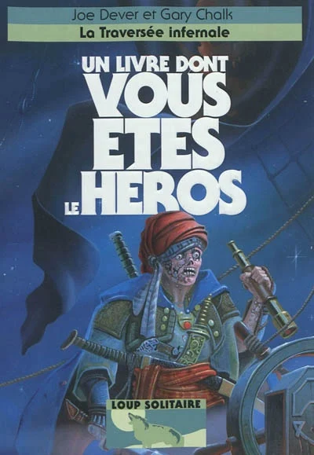
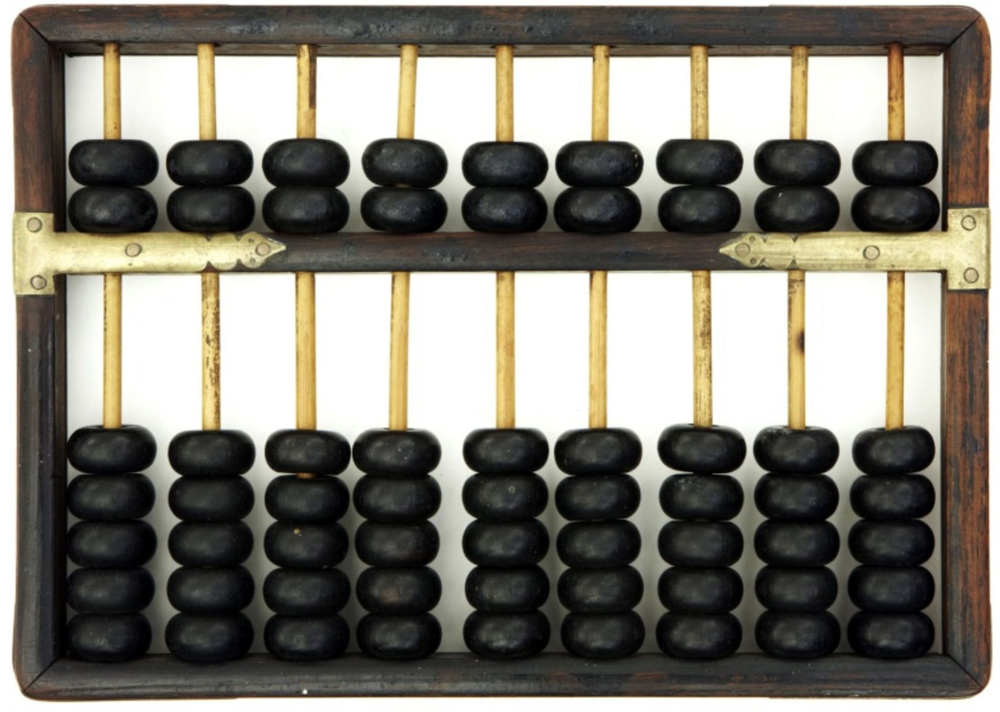
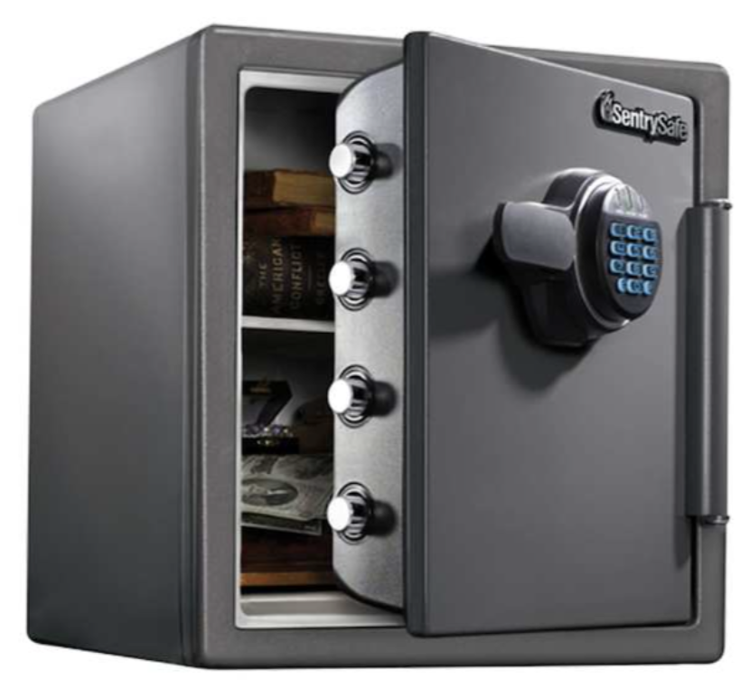
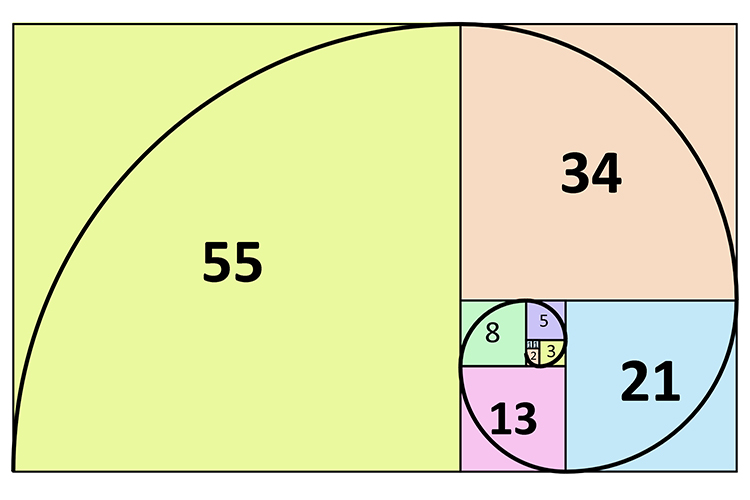

<p align="Center"></p>
<h3 align="Center">2Q2 - Développement Assembleur</h3>

# Exercices 05 - Les procédures

#### 📝 Lien vers les [notes de cours](https://slides.com/hkoncept/2q2-05/fullscreen?token=3QPss-cZ) !

#### 📁 [Structures de projets & consignes à suivre](../includes/rules.md)

## 🔁 Question 01 - Le père Mute va mieux !

<p align="Center"></p>
Reprendre la question 01 des exercices 01, (Le père Mute) et créez un algorithme très court qui permet de permuter les valeurs réelles de deux variables en mémoire. Codez l'affichage des valeurs de x et de y dans une procdure réutilisable.

```
Avant permutation x = 3 et y = 9
Après permutation x = 9 et y = 3
```

## Question 02 - La NASA

<p align="Center"></p>
La NASA vous a octroyé un contrat de programmation d'une procédure d'affichage du décompte pré-lancement d'une fusée. Cette procédure doit afficher `Attention: X`, où X est le chiffre passé en paramètre (en 'int'). La procédure affichera `Décollage !!!` lorsque le chiffre passé en paramètre sera de zéro (0).

```
Attention: 9
Attention: 8
Attention: 7
Attention: 6
Attention: 5
Attention: 4
Attention: 3
Attention: 2
Attention: 1
Décollage !!!
```

## Question 03 - La NASA (dont vous êtes le héros) !

<p align="Center"></p>

> Si vous avez créé trois procédures au total à la question 02, allez directement à la question 04 !

Le directeur de la NASA est très satisfait de votre travail avec eux mais il vous demande de faire une copie de votre précédent projet et maintenant de le faire fonctionner avec 3 procédures :

1. `print_warning` : "Afficher l'avertissement".
2. `char2db` : "Convertir un char en byte".
3. `db2char` : "Convertir un byte en char".

## 🧮 Question 04 - Multiplix Back In Track !

<p align="Center"></p>
Votre mission ici est de permettre à l'utilisateur de multiplier deux chiffres entrés du clavier et de donner la valeur à l'écran en utilisant deux procédures imbriquées (multiplication et affichage du résultat).

```plaintext
Entrez le premier chiffre : 8
Entrez le deuxième chiffre : 9
Votre résultat est : 72
```

#### Consignes

1. Créez une procédure `multiplix` qui s'occupe de multiplier deux caractères numériques transformés en nombre entier grâce à la procédure `char2db` codée à la question03.
2. Dans la procédure `multiplix` appelez également la procédure `dw2string` pour afficher la valeur à l'écran.

## 🔄 Question 05 - FibonaLoop

<p align="Center"></p>
Utilisant des procédures de la question précédente, demandez un nombre à l'utilisateur et affichez ce nombre d'éléments de la suite de Fibonacci en utilisant une procédure `fibonacci`.

```plaintext
Entrez un nombre : 20
Fibonacci #20 = 6765
```

## 🦺 Question 06 - FibonaSafe

<p align="Center"></p>
Reprennez votre solution de la question 04 et assurez-vous que l'utilisateur entre un nombre dont la réponse est gérable par ASM8086 (16 bits)...

##  DÉFI - Question 07 - FibonaCursive

<p align="Center"></p>
Utilisant du matériel des questions précédentes, demandez un nombre à l'utilisateur et affichez ce nombre d'éléments de la suite de Fibonacci en utilisant la **méthode récursive**.

```plaintext
Entrez un nombre : 20
Fibonacci #20 = 6765
```

> Un **point bonus** sera octroyé pour tous les étudiants en mesure de venir m'**expliquer** leur solution à ce défi pendant les heures de classe et ce, avant la date de remise.

<hr><p align="Center"></p>
